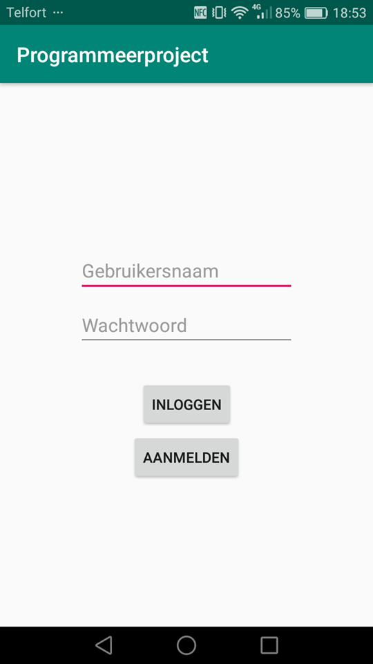

# Description
Een groepsfitness app die gebruikers in staat stelt zich in te schrijven voor groepsfitnesslessen bij het USC Universum.

# Design
## Activities and connections

## LoginActivity
Laat de user kiezen tussen inloggen met een bestaand account of een nieuw account aanmaken. Na inlog wordt de user 
naar de homepage gepusht

## RegisterActivity
Laat de user een nieuwe account aanmaken waarbij hij of zij een unieke gebruikersnaam MOET kiezen. en het 
gekozen wachtwoord bevestigd moet worden

## HomepageActivity
Laat alle registraties zien die vandaag of daarna gepland staan. Geordend op chronologische volgorde. Laat de user 
d.m.v. de button "Rooster" naar het rooster (OverviewActivity) navigeren en d.m.v. "Profiel" button naar de profielpagina 
(RegistrationsActivity) gaan. Als er op eenles in de listview gedrukt wordt, wordt de user doorgestuurd naar een detail pagina 
(DetailActivity).

## OverviewActivity
Laat in een horizontal scrollview alle lessen van de desbetreffende dag zien. Boven in de activity kan een gebruiker 
verschillende data selecteren d.m.v. de "Vooruit" en "Terug" buttons en op het moment dat er een lesbutton ingedrukt wordt, wordt 
de user weer doorgestuurd naar DetailActivity.

## RegistrationsActivity
Laat zien hoevaak de gebruiker zich in totaal al heeft ingeschreven met een Listview van maximaal 3 lessen waar voor hij of zij zich
het vaakst voor heeft ingeschreven. Men kan met de behulp van "Rooster" button terug navigeren naar het rooster (OverviewActivity) 
en met behulp van de button "Homepage" terug naar de homepage. OP het indrukken van een listview item wordt de gebruiker weer naar het
Detailscherm (DetailActivity) geleid.

## DetailActivity
Laat een titel en omschrijving zien voor een les en afhankelijk vanuit welke activiteit er genavigeerd werd, wordt er of een listview 
met alle identieke lessen in de komende week gevuld of er wordt een textview met een datum en tijd en een button die 'inschrijven' 
toont zichtbaar gemaakt. Als er op inschrijven of op een listitem gedrukt wordt zal de user ingeschreven worden voor een specifieke les.

# Classes

## Users
Een class die bestaat uit een username, een wacthwoord en een recenlessonlist. De class wordt gebruikt om te zien wie er toegang heeft
tot de applicatie en om te zien wie zich probeert in t schrijven voor een les. In eerste instantie was het idee om hier ook bij te houden
voor welke lessen de gebruiker zich het meest heeft ingeschreven maar dat is uiteindelijk niet meer gelukt. in de app zelf wordt er wel gekeken
wat de favoriete lessen van een gebruiker zijn

## Lessons
Een class die bestaat uit een Naam, Dag, Tijd, Locatie en omschrijving. De class wordt gebruikt om bij te houden welke lessen wanneer zijn en om
te zien voor welke les een user zich probeert in te schrijven. In eerste instantie was het idee om te zien hoeveel plekken er beschikbaar waren
voor elke les. Maar het is niet geluk die functionaliteit te implementeren.

## Registrations
Een class die bestaat uit een Naam, Datum, Tijd, Deelnemer. Wordt gebruikt om een user aan een les te binden. Op deze manier kunnen we bijhouden 
welke users zich hebben ingeschreven voor welke les en in theorie zouden we ook kunnen bepalen hoeveel plekker er nog over waren, maar door 
tijdsgebrek zijn we daar niet meer aan toe gekomen.

# Challenges
Zoals altijd komt voor mij het grootste gevaar uit he overzicht bewaren en begrijpen wat ik aan het doen ben en waar ik ben in dat proces.
Deze keer had ik niemand om me bij de hand te nemen en geen online handleidng die je stap voor stap mee neemt.
Daarnaast was het voor mij een punt van verbetering om niet te veel in een keer te schrijven maar stapsgewijs code te blijven testen en
van te voren te bedenken wat je PRECIES wil doen. Vaak als ik een bug vond die ik niet voorheen gezien had, kwam dat door een slordigheid
of voorwaarden waar ik op voorhand geen rekening mee had gehouden. Bijvoorbeeld het registratie probleem waarbij er onclick een andere les
werd geselecteerd dan er ingedrukt was, kwam doordat ik van te voren geen rekening had gehouden met het feit dat er meerdere identieke lessen
op een dag konden zijn. Ik ben er uiteindelijk niet achtergekomen hoe ik een object in de Rester API kan bewerken zonder hem helemaal te
verwijderen, maar ik heb een suitable work around gevonden door het object niet te verwijderen maar alle registraties van de gebruiker te lezen.

## most important changes
De belangrijkste veranderingen waren de beslissing om met listviews te gaan werken omdat horizontalscrollview veel te log waren voor het
uiteindelijke aantal objecten. 
Daarnaast heb ik in plaats van een lineaire navigatie waarbij elke activiteit maar naar een of twee andere pagina's leidt, uiteindelijk gekozen
om een meer circulaire navigatie te ontwerpen waarbij meerdere activities naar hetzelfde punt leiden en vanuit daar weer terug leiden naar hetzelfde 
punt. 

## Defense
Hiermee wilde ik mijn applicatie wat intuitiever maken en wat meer functionaliteit toevoegen om een wat fijner GUI te krijgen. Verder zijn er wat trade
offs betreffende het selecteren van lessen, registraties en users. Ik loop nu elke keer de gehele lijst aan alle users, lessen en registraties af.
Dit is zeer zeker enigszins rompslomp maar het is de manier die werkt. Daarnaast heb ik door de manier van inschrijven synchronisatie fouten. Ik ben er
achter gekomen dat door de manier van inschrijven voor een les de Rester API niet snel genoeg informatie post om te zorgen dat inschrijvingen meteen getoond
worden na inschrijven. Ik kwam hier vrij laat achter en kon niet zo snel een goede oplossing vinden, dus helaas gedraagt de Homepage zich soms wat willekeurig.

